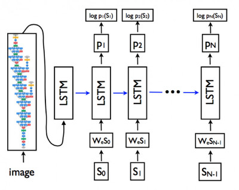

# 深度识图

深度识图是基于 [gotalk](https://github.com/agilab/gotalk) 作为后端识别引擎的前端小程序，使用了 Google 的深度学习图片识别技术，可以将一张图片转化为一句话描述。



这个小程序能识别大部分人物场景，也可以直接从头像识别头像内容。

## Demo


## 在线体验

扫一扫小程序码


## 快速上手

**后端**

[gotalk](https://github.com/agilab/gotalk)提供了后端的基本接口，以及图片识别算法。

此外还需要一个 [服务接口](https://developers.weixin.qq.com/miniprogram/dev/api/network/upload/wx.uploadFile.html) 处理小程序的图片上传并返回图片地址，请开发者自行解决。

**前端**

首先在 **project.config.json** 添加自己的 appid

在 **config.js** 中添加自己的后端服务地址

```js

export default {
    ServerUrl: '', // 在这里修改ServerUrl,也就是gotalk的地址
    uploadServerUrl: '' // 小程序图片上传的地址
}

```

之后用微信开发者工具打开，快速使用。

## 其他

目前不支持除 jpg 格式以外的图片, 有条件可用 oss 带参数链接自行解决。

更多问题欢迎加入我们的 QQ 群 850275221。
